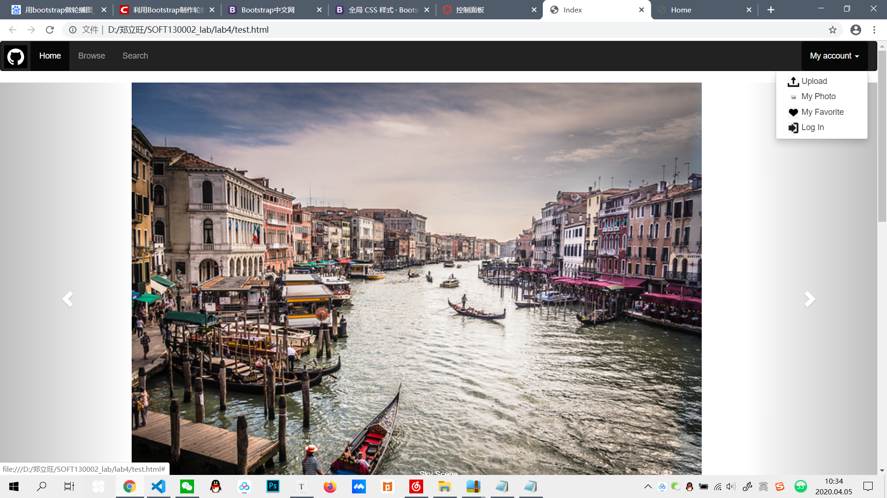
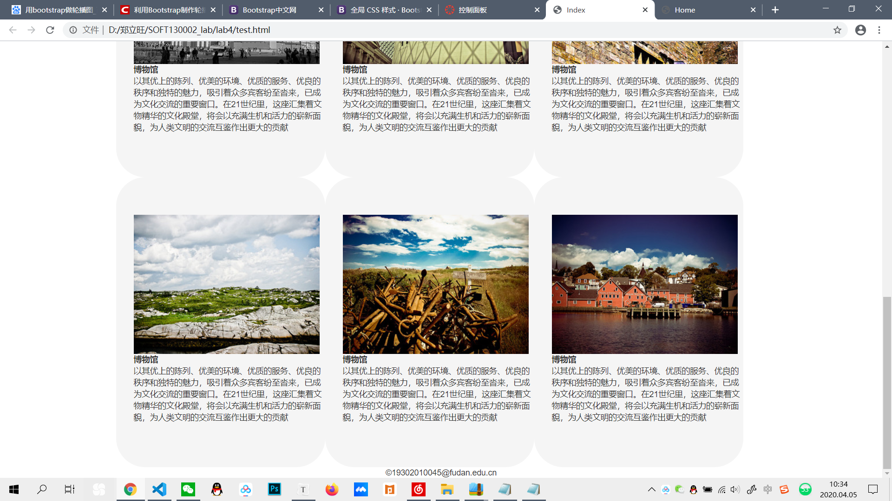

LAB4设计文档
===========
这次lab使用bootstrap的css样式，我认为主要的还是了解熟知其中各种类名和id的命名，这样才能在css的选择器上实现对应，所以这次的lab我认为就是一个了解的东西，并没有真正学习到太多的东西，我的lab的实现就是对助教的代码进行的修改，其实类名我也不太清楚是什么原理，因为原生的css可以自己命名，然而框架的css命名就必须限制，所以我对于bootstrap的命名还没有掌握。

大概的页面可以实现，因为助教的代码的命名是符合bootstrap的类名命名的，如果自己去写的话就很麻烦，就得一个个去查，去记，这样的效率省在了自己的原生css。但是这个类名的规范还是需要时间去记忆的。

---------------

##主页截图

